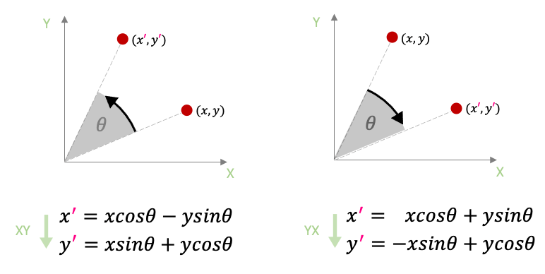
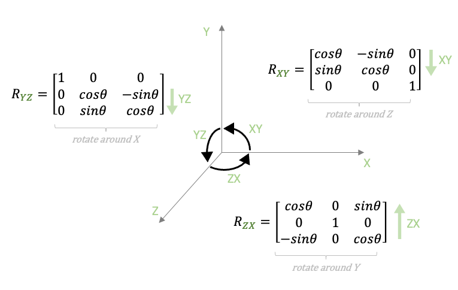
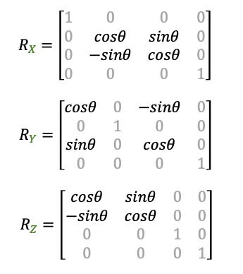

We just saw how we added a minus sign in front of the sine of the angle in the Y rotation matrix.

I want to go into a little more detail on why that is the case, and also use this moment to briefly talk about the direction of 3D rotations and how that is connected to coordinate-system handedness.

In 2D, we intuitively talk about clockwise and counterclockwise rotations:

Clockwise and counterclockwise only really exist in 2D, but since humans need to create some convention for the direction of a rotation in 3-dimensions (and higher-dimensions), we create this idea of a "3D clock." At the end of the day, it's just an arbitrary human decision on how we want to perceive our rotations, and what happens to our object as we increase or decrease the value of the angles.

One well-established convention is to use the left-hand or right-hand cross-product direction rule to determine the rotation direction of our system.

The image above shows how we try to maintain a counterclockwise rotation by flipping the sign of the rotation matrix entries.

This brings me to the main point of this discussion. Do you see how in the above image the Z-axis is pointing "outside" the screen? This means that these rotation matrices will perform this counterclockwise rotation for a right-handed coordinate system! If we really want to follow the proper cross-product direction in a left-handed system, we should change the signs of our matrix entries to account for that.

For most left-handed coordinate systems (like ours), the rotation matrices should be:

  

Flipping the sine of the angles make sure we follow the proper convention of cross-product direction.

That being said, you'll see that I will not change my rotation matrices to the left-hand form in my code. Some programmers might not like this decision, but I personally still like to see my angles grow the way they are currently.

Therefore, I'll keep my matrices as they are, in this right-handed form. Maybe in the future, I'll decide to change them; we'll see.

If you feel like you *must* have your matrices in proper left-handed form, you can simply replace your matrix rotation functions with the ones provided here: left-hand-rotation-matrices.zip

Again, this is not a dealbreaker. Remember that how we perceive rotation direction in 3D is simply a convention, and the math really does not care about our interpretation.