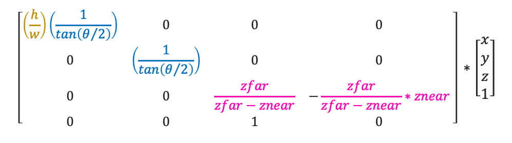
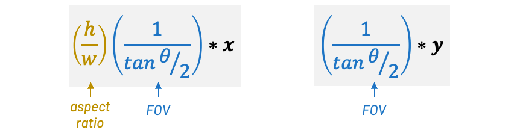
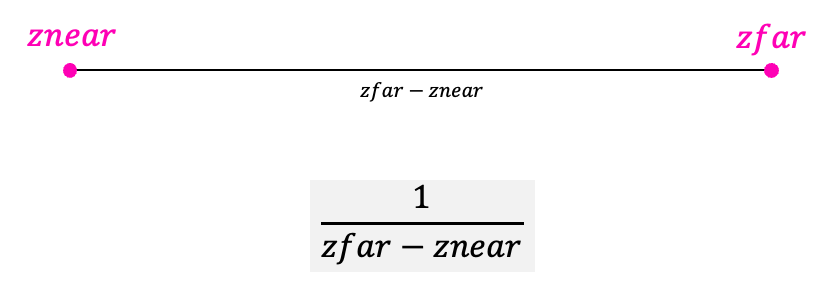
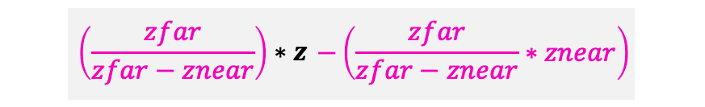
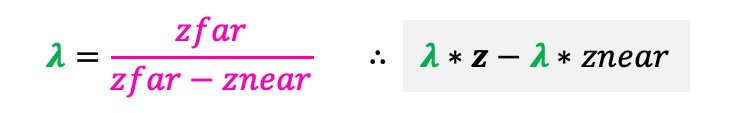

I know that the projection matrix can be a pain to digest, and since many students actually asked me to explain this a little bit better I think it's a good idea to leave some of these ideas written down.

Now that we know the entries of our projection matrix and we saw it in action in our code, let's go back and explain how we come up with those matrix entries again.

Here is how our final perspective projection matrix looked like:

Let's also recall that our perspective projection matrix has the following goals:

Normalize the x values to be between -1 and 1 based on the aspect-ratio and field of view.
Normalize the y values to be between -1 and 1 based on the field of view.
Normalize the z values to be between 0 and 1 from znear to zfar.
The normalization of x and y values based on aspect-ratio and FOV is usually easier to understand. If we forget that we are encoding multiplications using a matrix, our desired operations on x and y is:

Observe how the aspect-ratio (height/width) gives us a factor that we'll multiply by x to adjust the values to normalize them by the screen resolution. For example, if the screen resolution is 320x240, the aspect-ratio factor is 0.75.

The same idea holds true for the FOV factor. We consider the angle of opening θ and find a factor that multiplies x and y to normalize their values for this desired FOV angle.

Usually, the normalization of x and y are easy to understand; the pat that really confuses people is the z normalization from znear to zfar. So, let's break the z normalization apart and see if we can really create an intuition behind each step.

First, let's write down the operations on z without the matrix:

Pay attention to how we have a multiplication and a subtraction. Let's look at the multiplication first.

Our goal is to normalize the original z values so they are all from 0 to 1, where znear is 0 and zfar is 1.

Keep in mind that we are not showing here the perspective divide (division by the original z). The actual normalization (from 0 to 1) will occur after we divide things by the original z later. In other words, because the normalized z value will (in the perspective divide) still be divided by the original z value, it is normalized between 0 and zfar. The division by the original z value (inside w) will make it actually normalized between 0 and 1.

Therefore, the first thing we do is to normalize values between znear and zfar. This can be achieved using the fraction **1/(zfar-znear)**.

At the same time, we want our z values that are equal to zfar to be transformed to zfar, since the perspective divide is going to normalize that back to 1. We can accomplish this by scaling things by zfar. This gives us an intermediate result of zfar/(zfar-znear).

These steps take care of the zfar mapping and explain the multiplication part of our formula.

Finally, we also want the z values that are equal to znear to be transformed to 0. We can accomplish that by offsetting (subtracting) *something* from the previous intermediate result. This is what we called the "difference between the eye and the near plane" in our lecture.

Imagine for a second that we have a z value that is exactly znear. If we multiply this value with the previous intermediate result zfar/(zfar-znear), we get (znear*zfar) / (zfar - znear). Therefore, this is the "correction" we need to apply to transform our z values that are equal to znear to be equal to 0.

All of these steps will give us the final entries of the projection matrix to help us perform the desired z normalization.

In our lectures, I also chose to call zfar/(zfar-znear) as λ (lambda) . This is just notation and does not change anything in the meaning of our z normalization formula.

After we multiply our vertex with the projection matrix we proceed to do the perspective divide (division by the original depth value, which is saved inside w). Only after the perspective divide is that our z value will be in the range [0,1] for depth values between znear and zfar.

I hope this breakdown helped you connect things. I like to discuss things in a high-level and postpone an actual algebraic derivation if possible. There are some resources out there that will derive the z normalization algebraically, but I think the best way for us to get the intuition behind what we are trying to achieve is a friendly high-level conversation.

Also, I just want to end this conversation saying that this idea of creating a projection matrix is something very common in popular graphics APIs like OpenGL and Direct3D.

Direct3D has a function called D3DXMatrixPerspectiveFovLH() that receives as parameters the field of view, the aspect ratio, and the values of znear and zfar. You can read about this function in Microsoft’s DirectX official documentation here, and as you probably noticed, this function is very similar to our mat4_make_perspective().

OpenGL also has a function to create its perspective projection matrix. The function is called glFrustum() and this function behaves a bit different than ours since OpenGL's idea of a perspective projection matrix contains some different assumptions about how znear and zfar works and also accounting for OpenGL's right-handed coordinate system.

As far as the programmer is concerned, these Direct3D and OpenGL functions can be used as a black box. Just pass the correct parameters and the graphics API will handle all the internals of the projection matrix for you.

That being said, it is super important that we understand that the projection matrix that we are using is different than these projection matrices used by old fixed-function OpenGL or Direct3D. It's important to mention this because some online resources that you'll find out there will explain how to derive OpenGL's perspective projection matrix and they will end up with different formulas and different matrix entries than what we used. Every graphics API can use a different approach and these different assumptions have a direct impact on how we populate the entries of our projection matrix.

Still, it feels good to know how the matrix sausage is made. 🙂